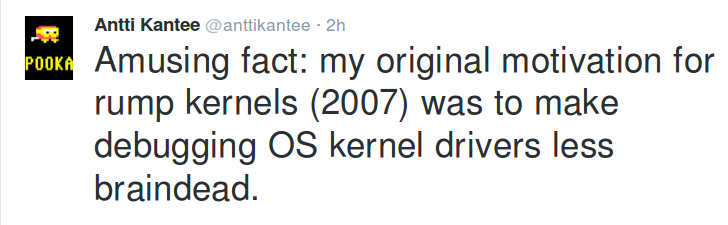

<!-- .slide: class="title" -->

# Composing Network Operating Systems

Mindy Preston

[https://mirage.io](https://mirage.io)
[https://somerandomidiot.com](https://somerandomidiot.com)

```ocaml
                        ##         .
                  ## ## ##        ==
               ## ## ## ## ##    ===
           /"""""""""""""""""\___/ ===
      ~~~ {~~ ~~~~ ~~~ ~~~~ ~~~ ~ /  ===- ~~~
           \\______ o           __/
             \\    \\         __/
              \\____\\_______/

```
[http://docker.io](http://docker.io)


----

# Where To?

+ Operating Systems From Above
+ "Library Operating System"
+ A Library from a Library Operating System
+ Composing an Operating System
+ Implications of Library Components
+ Rejecting the Default Reality and Substituting Our Own
+ Wilder Realities than So Far Imagined

Note:
Here's a quick overview of the landscape we're going to survey.  We'll talk a bit about interfacing with operating systems from an application developers' perspective.  We'll discuss what I mean when I say "library operating system".  We'll have a quick look at an example librayr from an OCaml library OS, then a look at how composing such libraries works.  Then we'll explore some interesting possibilities for our application development and debugging presented by library operating systems, exploiting the equivalence of the operating system's libraries and our own.


----

## By Way of Contrast

```
+------------------------+---------------+
| User-level Application | External Libs |
+------------------------+---------------+
       API in Your Language
+----------------------------------------+
|     Runtime (or not!), shared libs     |
+----------------------------------------+
      Sockets, syscalls, & such       
+----------------------------------------+
| scheduler, memory management, power,   |
| network, filesystems, clock, entropy,  |
| keyboard, video, ...                   |
+----------------------------------------+
| Hypervisor                             |
+----------------------------------------+
| Silicon bits                           |
+----------------------------------------+
```

Note:
Imagine we're application developers.  We have our application, written in our favorite language.  We probably also have some external dependendies, like maybe serialization or statistics libraries, that are also written in our language.  The interface between our software and these dependencies is defined by an API, also in the language we're working in.  It probably fits reasonably nicely into our application and affords us the same kinds of abstractions for dealing with data, errors, and exceptions as we're used to seeing from other code in our language.  If it doesn't, we can either find one that does or write one ourselves.  

Unfortunately, that's likely not all we need to interface with.  We probably also need to do things like communicate with a disk, a network, or maybe even a live human user at a keyboard.  If we don't want to write our own drivers, we need the operating system to do these things for us, which means we need to ask it to perform these tasks via the API it provides.  Our language likely provides us with a nice interface for doing these things as well, but once we look a little closer, it doesn't look so nice at all.


----

## Some Socket Functions

A selection from OCaml:

```ocaml
val socket : socket_domain -> socket_type -> int ->
             file_descr
(** create a new socket with
   a given network layer implementation,
   transport layer implementation,
   and (optional) protocol type *)

val connect : file_descr -> sockaddr -> unit
(** connect a socket to an address; 
    will throw exceptions for non-socket file_descr
    or connection errors *)
```

Note:
Here's a small selection from the representation of the sockets API in OCaml's Unix module.  While it's in an application-level language, it's really an expression of the sockets API that the underlying operating system provides to us.  

We can build libraries of our own on top of this that attempt to abstract away the non-typeful ugliness here, but at some level we *have* to interact with this.  At best, we might have out-of-band access to more information than the return types defined here.  That `connect` in particular is not very nice, in particular considering that this is a very common failure point in an application.


----

## Library Operating System

```
+---------------------------------------------------------+
| User-level Application                                  |
+---------------------------------------------------------+
                 API in Your Language
+---------------------------------------------------------+
| Networking | Storage | Timekeeping | Randomness | ....  |
+------------+---------+-------------+------------+-------+
                 API in Your Language
+---------------------------------------------------------+
| Application runtime                                     |
+---------------------------------------------------------+
| Hypervisor                                              |
+---------------------------------------------------------+
| Silicon bits                                            |
+---------------------------------------------------------+
```

Note:
Now let's imagine that I'm building running my code for petfinder.com in a different context.  Instead of using a traditional monolithic kernel like Linux, I've decided to seek out great fortune and use a library operating system instead.  In this model, the things I need from the operating system like networking, storage, timekeeping, and randomness are implemented as libraries in the same language that I wrote backend code in, and they run on the same application runtime as my code!  There are still layers that aren't easy for me to understand, but there are fewer of them.  And more code is runinng in an environment that I already need to know things about!


----

## What do the Libraries Look Like?

+ An interface definiton for common operations
  * "check the time", "get a random number", "send a packet", "write a file"
  * (MirageOS: module types)
+ Implementations of that interface
  * "interact with a btrfs filesystem", "interact with a HFS+ filesystem"
  * (MirageOS: modules)

Note:
So what does these libraries actually look like?  They look pretty much like libraries you might be used to using in other contexts - a definition of some stuff the library does through an abstract interface, and some implementations of that interface.


----

## What's a File System?

```ocaml
  val read: t -> string -> int -> int
              -> [ `Ok of page_aligned_buffer list
                 | `Error of error ] io
  (** [read t key offset length] reads up to [length] bytes
      from the value associated with [key]. If less data is
      returned than requested, this indicates the end of the
      value. *)

  val write: t -> string -> int -> page_aligned_buffer ->
      [ `Ok of unit | `Error of error ] io
  (** [write t path offset data] writes [data] at [offset]
      in file [path] on filesystem [t]. *)
```

Note:
Here's a subset of the MirageOS definitions for what you might like to do with a file system.  They're written just like the API definitions you might see for a string parsing library or a library for talking to Slack or GitHub.  Errors and exceptions can come from them just as they would come from your application code, instead of through a different system like ERRNOs.  I'll point out also that this is OCaml code; OCaml is a language with a strong type system, and OCaml users tend to like types.  We can use OCaml's types when interacting with these libraries, rather than having to just hope that, say, the buffer we're passing came from a function that makes sure the memory is page-aligned.  Other languages have other sorts of features that people like, and library operating systems give users a way to use these features deeper in the stack.


----

## What's an Implementation Look Like?

```ocaml
let read filesystem path the_start length =
  let path = Path.of_string path in
  if_formatted filesystem (fun fs ->
     find x.device fs path >>= function
     | `Ok (Dir _) -> return (`Error
        (`Is_a_directory (Path.to_string path)))
     | `Ok (File f) ->
       read_file filesystem.device fs f the_start length >>=
        fun buffer -> return (`Ok buffer)
     | `Error x -> return (`Error x)
    )
```

Note:
What do the implementations look like?  They're also just like application code written in this language.  Here's an example from the MirageOS FAT16 filesystem implementation -- this is our implementation of the `read` function.  Depending on your facility with OCaml, you may find this more or less comprehensible, but the shape of it is generally understandable.


----

## Composing Libraries into an Operating System

```ocaml
type output =
  | Unix_process
  | Xen_unikernel

val compose : application -> dependencies list ->
              implementations list -> output
```

Note:
We'll call the system for composing all of these libraries into one runnable
unit a library operating system, and for the purposes of this talk I'll call the
output of this process a unikernel, although it doesn't necessarily need to be
one -- in MirageOS as well as other library operating systems, you can also
build your application as a more conventional process to run on top of a
traditional operating system.


----

## Why?



Note:
Some things are *easier* to do in a library operating system than a monolithic kernel.  We don't need to set aside hardware to boot the kernel we're developing; we can just write test code using our normal test framework for any other application in the language we're targetting.


----

## Testing a MirageOS "Driver"

```ocaml
let test_marshal_padding () =
  let buf = Cstruct.create 8 in
  Cstruct.memset buf 255;
  let extract = Cstruct.get_uint8 buf in
  let needs_padding = [ Tcp.Options.SACK_ok ] in
  check 4 (Tcp.Options.marshal buf needs_padding);
  check 4 (extract 0);
  check 2 (extract 1);
  check 0 (extract 2); (* 0 out everything else *)
  check 0 (extract 3);
  check 255 (extract 4); (* but not into random memory *)
  Lwt.return_unit
```

Note:
For example, we can write some fairly pedestrian code to test serializing and deserializing TCP options in the kernel; this test, and many others like it in the MirageOS network stack, are trivially runnable with the same test framework you'd use for a web application.


----

## Testing Network Stack

```
$ ./test.native test tcp_options|grep -v SKIP
[OK]        tcp_options  0   unmarshal broken mss
[OK]        tcp_options  1   unmarshal option w/bogus length
[OK]        tcp_options  2   unmarshal option w/zero length
[OK]        tcp_options  3   unmarshal simple cases
[OK]        tcp_options  4   unmarshal stops at eof
[OK]        tcp_options  5   unmarshal tcp options
[OK]        tcp_options  6   unmarshal random data returns
[OK]        tcp_options  7   marshal unknown value
[OK]        tcp_options  8   marshal when padding is needed
[OK]        tcp_options  9   marshal the empty list
Test Successful in 0.015s. 10 tests run.
```

Note:
We don't even have to run these tests in a strange environment; we can run them as normal userspace code, so we don't have to wait for a long deploy and boot cycle to see whether we've broken things.  We can use our normal debugging tools, like a REPL, on them too!


----

## Substituting Our Own Reality

```
val compose : application -> dependencies list ->
              implementations list -> unikernel

let test_application = compose application depends \
    my_implementation::implementations
```

Note:
The flexibility of libraries isn't just one way.  In addition to calling our operating systems libraries from application code, we can also write our own operating systems libraries and use them in our applications!  All we need to do is provide an implementation that fulfills the interface, but does something we like better.


----

## Example: Controlling Time

```
module Fast_clock : sig
   include V1.CLOCK
end = struct
  let last_read = ref (Real_clock.time ())
  let time () =
    let this_time = Real_clock.time () in
    let clock_diff = ((this_time -. !last_read)
                   *. time_reduction_factor) in
    last_read := this_time;
    this_time +. clock_diff
end
```

Note:
Imagine we have an application that includes some logic based on expiration times.  We want to test *our actual application code*, not modified code where we've dummied out the calls to the clock.  But we also don't want to wait the entire expiration interval to see whether our logic is correct.  With a library operating system, we can run our code with a clock implementation that behaves according to the rules we want!  Maybe it's aging in double-time like our example, or maybe it's slowed down dramatically to ensure that your application can handle multiple events with the same timestamp.  Maybe it sometimes goes backward.  Maybe it always tells you that the date is February 29th, 2000.


----

## Other Ideas

+ network interfaces that always have new packets waiting
+ random number generators that read from a list
+ entropy sources that always block
+ filesystems that are always full
+ block devices that are always busy
+ DNS that always returns the IP of cert-check-check.house-of-dns-hijacks.com

Note:
Here are some other ideas for fun implementations of the interfaces a library operating system might have.  Being able to swap these in quickly, and run tests in userspace, is super useful!


----

## Wilder Thoughts

+ How can we examine and manipulate state?

Note:
Of course we can do things other than just writing intentionally broken or wacky implementations to test that our applications do the right thing in error conditions.  Often, particularly when debugging, we want to have some access to the internal state of some dependency.  In a monolithic kernel we have to either run userspace tools that know how to inspect kernelspace for these things, or maybe we have a system like /proc where we can go hunting for the information.  Maybe we'll have a write interface, and maybe we won't.  Could we do better?


----

## Example: Put An Irmin On It

+ Irmin: library for persistent stores w/built-in snapshot, branching, & reverting mechanisms
  - (presents interfaces that look a lot like git)
  - multiple backends, including in-memory and on-disk

Note:
We could use a featureful library for storing state that gives us some affordances for examining and changing that state!


----

## Irmin-ARP

+ Normal operation: store a map from IPv4 addresses to MAC addresses in an in-memory Irmin store
+ For live testing: same table, same store, but swap the in-memory backend for on-disk store
   - now `git log` gives us the entire history of changes to the map!
   - Committing to the repository lets us change the data live and see how our code reacts!


----

## Visualizing Control Flow

+ What if the scheduler left a log?
+ ["Visualising an Asynchronous Monad"](https://roscidus.com/blog/blog/2014/10/27/visualising-an-asynchronous-monad/), Thomas Leonard


----

## Your Idea Here?

+ Library operating system projects and languages:
  - HaLVM (Haskell)
  - MirageOS (OCaml)
  - runtime.js (JavaScript)
  - More at [http://unikernel.org](http://unikernel.org) !
